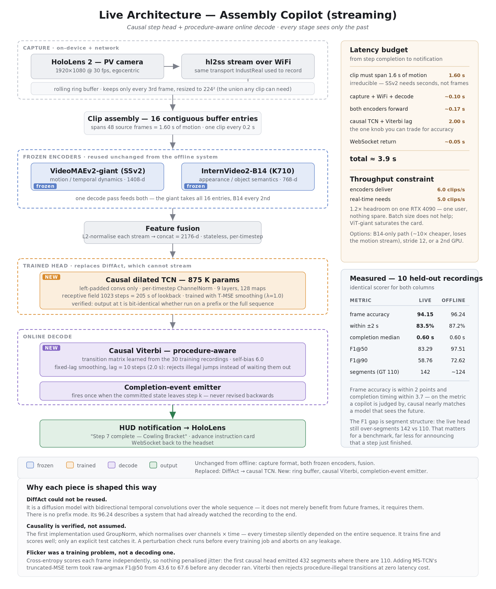

# Assembly Copilot

Training and serving a **Procedure Step Recognition (PSR)** model for a
turbofan engine-model assembly task, from egocentric (first-person) video.
Given a video stream of someone assembling or disassembling the engine model,
the system recognizes **which step of the procedure is happening right now**,
detects when each step **completes**, and highlights the **next part** to pick
up — the building blocks of an assembly "copilot" that guides an operator
through the procedure.



The repo contains three strands that share one dataset:

1. **`psr_tas/` — offline model training.** Two frozen video encoders
   (VideoMAEv2-giant + InternVideo2) are fused into 2176-d per-clip features; a
   DiffAct diffusion action-segmentation head is trained on top. This is the
   accuracy reference.
2. **`live/` + `live_app/` — the live system.** A lightweight *causal* TCN is
   trained on the same features so predictions at time *t* use only frames ≤ *t*.
   `live/` replays recorded videos through this pipeline in a browser demo;
   `live_app/` runs the identical pipeline on a real phone camera stream.
3. **`detector/` + labeling tools — part detection.** A YOLO11s detector is
   trained on annotated frames to localize the 10 engine parts, powering the
   demo's "next part" box overlay. `frames_to_annotate/`,
   `aiops_parts_detection_frames/`, and `run_labelstudio.sh` are the frame
   sampling → annotation → dataset flow that produced its training data.

---

## Repository layout

| Path | What it is |
|---|---|
| `psr_tas/` | PSR/TAS training pipeline: feature extraction, label building, DiffAct configs, eval results |
| `psr_tas/extern/` | **Not committed** — five upstream repos, cloned at pinned SHAs; see [psr_tas/extern/README.md](psr_tas/extern/README.md) |
| `live/` | Replay demo server (FastAPI, port 8099): pick/upload a video, watch causal predictions + saliency + next-part box in real time |
| `live_app/` | True live demo (FastAPI + HTTPS + WebSocket, port 8444): an iPhone at `/phone` streams frames; a dashboard at `/` shows live inference |
| `detector/` | YOLO11s part-detector training: configs, negatives, eval snapshots |
| `frames_to_annotate/` | Frame sampler + manifests: which video frames were selected for box annotation and why |
| `aiops_parts_detection_frames/` | The finished detection dataset: 114 frames / 587 boxes / 10 classes (YOLO labels + COCO JSON; images not committed) |
| `dataset/` | Dataset **metadata + PSR labels only** (videos not committed): `prod_dataset/` is the curated 40-recording corpus in IndustReal layout, with its own detailed [dataset card](dataset/prod_dataset/README.md) |
| `run_labelstudio.sh` | Launches Label Studio for box annotation of extracted frames |
| `test.ipynb` | Scratch experiment: YOLOE visual-prompt detection as a candidate auto-labeler |
| `assets/` | Architecture diagrams + YOLOE visual-prompt reference image |

---

## The full pipeline

```
egocentric recordings (assembly_video_recorder)
        │  labeled with assembly_video_labeler → PSR_labels.csv per video
        ▼
dataset/prod_dataset/          40 curated recordings, IndustReal-compatible layout
        │
        ├──────────────── PSR / step recognition ─────────────────┐
        │                                                          │
        │  psr_tas/scripts/00_build_labels.py                      │
        │      PSR csv → per-frame class labels (groundTruth/)     │
        │  psr_tas/scripts/01_extract_v2.py                        │
        │      VideoMAEv2-giant, 16-frame clips → 1408-d           │
        │  psr_tas/fusion/scripts/extract_iv2.py (or extract_both) │
        │      InternVideo2-B14, same windows → 768-d              │
        │  psr_tas/fusion/scripts/fuse.py → 2176-d fused features  │
        │  psr_tas/scripts/03_prepare_diffact.py                   │
        │      stage DiffAct dataset (features symlinked)          │
        │      → train DiffAct offline head  (accuracy reference)  │
        │      → live/scripts/train_causal.py  causal TCN          │
        │            → live/serve_demo.py   (replay demo)          │
        │            → live_app/server.py   (phone live demo)      │
        │                                                          │
        └──────────────── part detection ──────────────────────────┘
           frames_to_annotate/extract.py   sample frames from videos
           run_labelstudio.sh / box_part_labeler   draw boxes
           aiops_parts_detection_frames/   assembled YOLO dataset
           detector/train.sh               YOLO11s @ 1280 px
           → weights consumed by the demos' next-part overlay
```

---

## 1. `psr_tas/` — offline PSR training

**Architecture ("v4" stack):** two frozen encoders, L2-normalized and
concatenated, feeding a DiffAct diffusion segmentation head.

- **Encoder A** — VideoMAEv2 `vit_giant_patch14_224` (SSv2-finetuned), 16-frame
  clips → 1408-d. For 30 fps footage pass `--frame_gap 3` so a clip spans the
  same ~1.6 s of motion as IndustReal's 10 fps (the flag's help text explains
  the math).
- **Encoder B** — InternVideo2 `internvideo2_base_patch14_224` (K710), 8 frames
  from the same window → 768-d. Its `--frame_gap` **must match** encoder A's or
  the two streams silently misalign.
- **Head** — DiffAct with `input_dim: 2176`, 10-layer encoder / 8-layer
  decoder, 1000 diffusion timesteps, 25 DDIM sampling steps
  (`extern/configs/*-Fusion-S1.json`).
- **TYPE head** — a second DiffAct head with 4 classes
  (none / correct / incorrect / remove).

**Data folders:**

- `data/` — IndustReal ground truth in MS-TCN layout: `mapping.txt` (11 step
  classes), `groundTruth/*.txt` per-frame labels, `splits/*.bundle`.
- `data_copilot/` — the same layout for the **in-house turbofan dataset**
  (built from `dataset/prod_dataset` by `00_build_labels.py`).
- `data_v2/features/`, `fusion/data/` — extracted `.npy` features
  (**not committed**; ~1.7 GB, regenerable with the scripts above).

**Reference results** (`eval_out/results.json`, IndustReal, n=32):
Acc **84.2** · Edit **87.2** · F1@{10,25,50} **88.8 / 87.7 / 79.9**.

**Extras:** `live_monitor.py` is a stdlib-only training dashboard (port 8077)
that renders the architecture diagram with live loss/GPU overlays by tailing
`logs/` and `nvidia-smi`. `scripts/copilot_metrics.py` / `copilot_report.py`
compute copilot-specific metrics (step-completion timing) on the turbofan data;
`run_copilot_pipeline.sh` chains the whole thing.

## 2. `live/` — replay demo (port 8099)

`serve_demo.py` replays a chosen or uploaded recording *as if it were
streaming*: the causal TCN + fixed-lag online Viterbi decoder
(`scripts/causal_decode.py`) only ever see frames ≤ *t*. The single-page UI
(`web/demo.html`) shows the video with two overlay canvases — VideoMAEv2
attention **saliency** and the YOLO **next-part box** — plus a ground-truth vs
prediction timeline, a step-completion event log, and throughput stats.

- Causal model: `nets/causal_tcn.py`, 9 dilated layers, k=3 → receptive field
  1023 clips (≈205 s); includes a `check_causality()` self-test.
- Decoding: online Viterbi with transition prior; best sweep config
  `tmse1.0_drop0.25` with lag=10, self-bias 6.0 → **93.45 acc / 58.76 F1@50**
  vs the offline DiffAct reference 96.24 (sweep tables in
  `logs/grid_results.txt`, `logs/grid2_results.txt`).
- `run_demo.sh` supervises the server (auto-restart); the server has a 10 GB
  RSS watchdog to pre-empt the OOM killer.
- Serving helpers: `make_proxies.sh` builds 480p proxies for smooth scrubbing.

## 3. `live_app/` — true live demo (port 8444, HTTPS)

The phone **is** the camera: `/phone` captures 512×288 JPEGs and pushes them
over a WebSocket at 10 fps (the model's own cadence, ~400 KB/s); the dashboard
at `/` watches the same session over SSE/WebRTC. HTTPS is mandatory because iOS
only allows camera access on secure origins. Inference is identical to `live/`
but the TCN input is windowed to 1024 steps for constant per-tick cost.
`tools/drive_from_video.py` fakes a phone by streaming a recording over the
ingest WebSocket at true 10 fps — useful for testing without a device.

## 4. `detector/` — part detector

Ultralytics **YOLO11s at 1280 px** (small parts: the Propeller Cone Tip
averages 0.7 % of the frame). The key lesson is encoded in the configs:
training on studio photos alone scored mAP50 0.995 *on photos* but found only
2/10 classes on real video, so `cfg/merged.yaml` mixes **95 studio photos + 94
annotated video frames + 26 negatives** and validates on **video frames only**.
Final v2 run: **P 0.847 / R 0.786 / mAP50 0.876** on 105 video-frame instances
(sample outputs in `eval/`). Weights and runs are not committed — retrain with
`train.sh` after fixing the dataset paths (below).

## 5. Labeling flow for detection data

1. `frames_to_annotate/extract.py` samples frames from `dataset/prod_dataset`
   — 80 "pickup" frames 2 s before each step completion + 60 spread across
   step progress; `manifest.json` records exact provenance. Its README states
   the five labelling rules used.
2. Boxes are drawn either in **Label Studio** (`run_labelstudio.sh`) or with
   the standalone [Box Part Labeler](../box_part_labeler).
3. The finished dataset lives in `aiops_parts_detection_frames/` (YOLO labels,
   COCO JSON, splits, `data.yaml`; images excluded from git — regenerate them
   with `extract.py` or copy them from the data drive).

---

## Setup

```bash
# 1. Python env (conda recommended): torch + timm + ultralytics + fastapi + uvicorn etc.
#    The original machine uses a conda env named `psr_env`.
# 2. Third-party repos + patch + configs + encoder weights:
#    follow psr_tas/extern/README.md
# 3. Data: place recordings under dataset/ (see dataset/prod_dataset/README.md)
# 4. Extract features → train → demo, in the order shown in the pipeline diagram.
```

### ⚠️ Paths you must edit for your machine

The code predates this reorganization and uses absolute paths from the original
lab machine. Before running, update:

| File | What to change |
|---|---|
| `live/serve_demo.py` | `PSR` (→ this repo's `psr_tas/`), `LIBRARY` (→ `dataset/prod_dataset`), `DET_WEIGHTS` (→ your trained YOLO `best.pt`) |
| `live_app/server.py` | `LIVE`, `PSR`, `CERTS` (point at a folder with `cert.pem`/`key.pem`; generate like the [recorder](../assembly_video_recorder) does) |
| `live/scripts/*.py`, `live_app/tools/drive_from_video.py` | dataset/feature paths (`DS`, `LIB`) |
| `frames_to_annotate/extract.py` | `LIB` (→ `dataset/prod_dataset`) |
| `psr_tas/scripts/run_*.sh` | the `cd` at the top and the conda activation |
| `detector/cfg/*.yaml`, `cfg/*_abs.txt`, `aiops_parts_detection_frames/data.yaml` | absolute image paths (`merged.yaml` + `merged_*.txt` are the working config; `parts.yaml` references a folder that no longer exists) |

### What is *not* in this repo (and where it lives on the lab machine)

| Not committed | Size | Original location |
|---|---|---|
| Raw + curated videos | ~22 GB | `assembly_copilot/dataset/` |
| Extracted features (`.npy`) | ~1.7 GB | `psr_tas/data_v2/`, `psr_tas/fusion/data/` |
| Model weights (`.pt/.pth/.bin/.model`) | ~600 MB | `detector/runs/`, `live/runs/`, `psr_tas/weights/`, DiffAct results |
| Detection frame images | ~74 MB | `frames_to_annotate/images/`, `aiops_parts_detection_frames/images/` |
| Label Studio venv | ~1 GB | `labelenv/` |

Everything committed here is code, configs, annotations, and small metadata —
the repo clones at ~20 MB.
